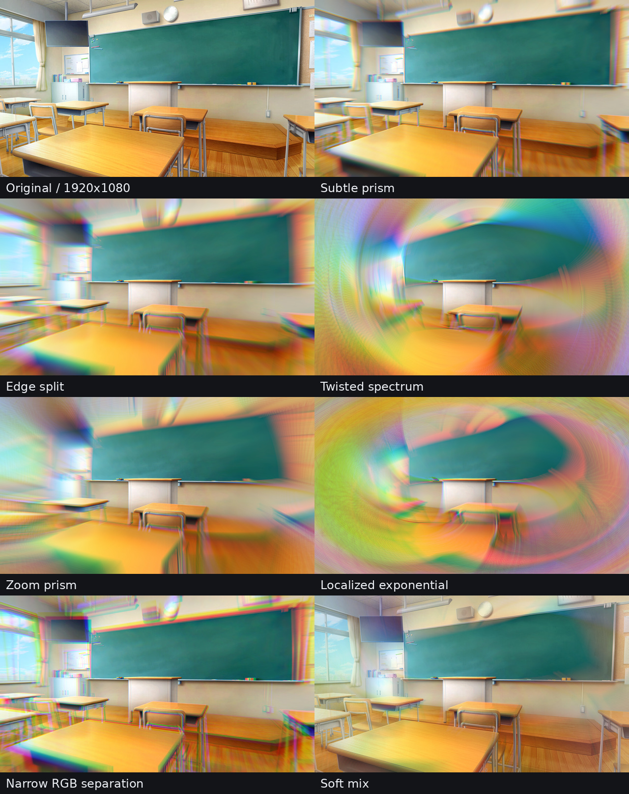

# Sa_chromablur

YMM4用の色収差エフェクトです。画面の中心から外側へ、赤・緑・青の位置を少しずつずらします。ラジアルやスケールを加えると、ねじれやプリズムのような見た目も作れます。
結構改善の余地ありそうなのでフォークしていただいて構いません
## パラメーター

| 名前 | 内容 |
| --- | --- |
| 収差 | 色をずらす量。大きいほど色が離れます。 |
| 減衰 | 外側に向かって効果を強くする度合い。 |
| 半径 | 効果が広がる範囲。小さくすると中心付近に集まります。 |
| 減衰形式 | 効果の変化のしかた。 |
| ラジアル | 色ずれに回転を加えます。 |
| スケール | 色ごとに拡大率を変えます。 |
| 中心X / 中心Y | 効果の中心を動かします。0で画面中央です。 |
| ステップ数 | 滑らかさ。大きいほど滑らかですが重くなります。 |
| 強さ | 元の映像との混ぜ具合です。 |
| スケール方式 | 「絶対値（反転なし）」を基本にしています。 |
| 色空間 | RGB（初期値）と15種類の自作変換から選べます。 |

！ステップ数を上げないと汚いです！

## インストール

[Releaseページ](https://github.com/sabiasagimp4-ai/SaChromaticAberration/releases) から `.ymme` ファイルをダウンロードし、YMM4で開いてください。
